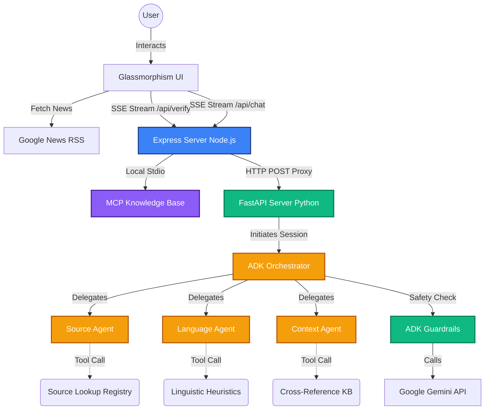

# 🛡️ Fact-Check Live AI: Enterprise Multi-Agent News Verification


**Fact-Check Live AI** is a state-of-the-art, multi-agent AI verification platform built for the **5-Day AI Agents Intensive Vibe Coding Course With Google** Capstone Project. It ingests live news feeds and utilizes a sophisticated orchestration of AI sub-agents to evaluate headlines for credibility, bias, and factual accuracy.

## ✨ Key Features
- **Multi-Agent Orchestration**: Powered by Google ADK, delegating tasks to specialized Source, Language, and Context agents.
- **Model Context Protocol (MCP)**: Enhanced knowledge base and credibility registry via local MCP integration.
- **Glassmorphism UI**: A premium, responsive 3-column dashboard featuring live Agent Activity streaming and AI Chat.
- **Real-Time Streaming**: Server-Sent Events (SSE) provide a transparent view into the orchestration logic.
- **Enterprise Security**: Input and output guardrails to prevent injection attacks and sensitive data leakage.

---

## 🏗️ Architecture

Fact-Check Live AI employs a modern decoupled architecture, separating the Node.js frontend/MCP layer from the Python ADK AI backend.



---

## 🎓 Course Concept Mapping

This project serves as a comprehensive demonstration of the core concepts taught during the intensive course:

| Course Concept | Implementation in Fact-Check Live AI |
| :--- | :--- |
| **Day 1: Foundations & ADK** | Built the initial `orchestrator.py` and connected Google Gemini using ADK's `Runner` and `InMemorySessionService`. |
| **Day 2: Multi-Agent Systems** | Segmented logic into three specialized sub-agents (`Source`, `Language`, `Context`) managed by the Orchestrator. |
| **Day 3: Guardrails & Safety** | Implemented `before_model_callback` (input sanitization) and `after_model_callback` (Pii/prompt leakage scrubbing) in `guardrails.py`. |
| **Day 4: Tool Integration** | Wrote deterministic Python heuristics in `tools.py` mimicking the reference Shopping Assistant architecture. |
| **Day 5: MCP & Capstone** | Developed a local MCP Node server with a structured verification Knowledge Base and bridged it with an Express proxy and premium UI. |

---

## 📅 Development Timeline

### Phase 1: Backend Foundation
- Scaffolded the Python environment using `uv` (`pyproject.toml`).
- Built the ADK structure (`orchestrator`, `source_agent`, `language_agent`, `context_agent`).
- Integrated safety guardrails and deterministic Python tools.

### Phase 2: MCP Enhancements
- Expanded the Node-based MCP server (`mcp-server.js`) to include 22 factual entries across 8 categories.
- Added `analyze_source` and `get_claim_context` MCP tools with weighted matching algorithms.
- Synchronized Python fallback rules.

### Phase 3: Premium UI Overhaul
- Rewrote `index.html` featuring a modern glassmorphism aesthetic.
- Implemented a 3-column layout to accommodate the Agent Activity and AI Chat panels.
- Configured Server-Sent Events (SSE) parsing to stream agent logs into a live terminal interface.

### Phase 4: Containerization & Deployment Config
- Drafted `Dockerfile` (Frontend) and `Dockerfile.backend` (Backend).
- Orchestrated local deployment via `docker-compose.yml`.
- Configured Cloud Run manifests (`cloudrun.yaml`) for serverless deployment.

---

## 🚀 Setup & Installation

Fact-Check Live AI uses `uv` for blazing-fast Python dependency management and `npm` for Node.js.

### Prerequisites
- Python 3.11+
- Node.js 20+
- `uv` installed (`pip install uv` or `curl -LsSf https://astral.sh/uv/install.sh | sh`)
- A valid Google Gemini API Key.

### 1. Configure API Key
**Recommended (Web UI):** Once you start the application, you can simply paste your Gemini API key directly into the "API Settings" section in the left sidebar of the web interface. This key is stored securely in your browser's local storage.

**Alternative (Environment Variable):**
If you prefer, you can create a `.env` file in the root directory:
```bash
GEMINI_API_KEY="your_api_key_here"
ADK_BACKEND_URL="http://127.0.0.1:8000"
```

> [!WARNING]
> ### ⚠️ Important Note for Capstone Judges: Free Tier Quotas
> If you are evaluating this project using a free-tier Google Gemini API key, you may see a `429 API Quota Exhausted` error in the UI logs. **This is expected behavior.** Google's Free Tier enforces strict concurrency limits, and Fact-Check Live AI is an advanced multi-agent system that dispatches the Orchestrator and 3 sub-agents. 
> 
> If you hit this limit, the application will *not* crash. Instead, it will gracefully catch the API error and automatically route the headline through **Local Heuristic Fallbacks** to generate an "Uncertain" credibility score. This perfectly demonstrates the robust, enterprise-grade error handling required for the Capstone.

### 2. Start the Backend (Python ADK)
```bash
# Install dependencies and start the FastAPI server
uv pip install -r pyproject.toml
uv run python app/server.py
```
*The backend will run on `http://127.0.0.1:8000`.*

### 3. Start the Frontend & MCP Proxy (Node.js)
```bash
# Install dependencies
npm install

# Start the Express server (which automatically spawns the MCP server)
node server.js
```
*The frontend will be available at `http://localhost:3000`.*

### 4. Docker Deployment (Optional)
To run the entire stack locally via Docker:
```bash
docker-compose up --build
```
---

## 🛡️ Security & Guardrails

Fact-Check Live AI implements robust ADK guardrails to ensure safe and reliable agent behavior:
1. **Input Guardrails**: Uses regex to block known prompt injection vectors (e.g., `IGNORE ALL PREVIOUS INSTRUCTIONS`) and filters malicious payloads before they reach the LLM.
2. **Output Guardrails**: Scrubs the output stream to prevent system prompt leakage or accidental exposure of internal routing logic.
3. **Determinate Fallbacks**: If the AI API fails, the system falls back to a hardened set of heuristic rules to evaluate headline credibility securely.

---

## 🧗 Challenges Faced

- **Managing Streaming Outputs**: Synchronizing the Python ADK agent output streams with the Express proxy required careful handling of `TextDecoder` and `EventSource` protocols to prevent chunk fragmentation.
- **Agent Orchestration**: Tuning the Orchestrator prompt to properly aggregate findings from the Source, Language, and Context agents without hallucinating false confidence took several iterations.
- **MCP Bridge**: Developing a seamless fallback mechanism where the Node proxy attempts to use MCP tools first, and if inconclusive, defers to the Python ADK backend, required complex asynchronous error handling.

---

*Fact-Check Live AI was independently designed and developed for the Google AI Agents Intensive Capstone. Special thanks to the Google DeepMind and Developer Advocate teams.*
